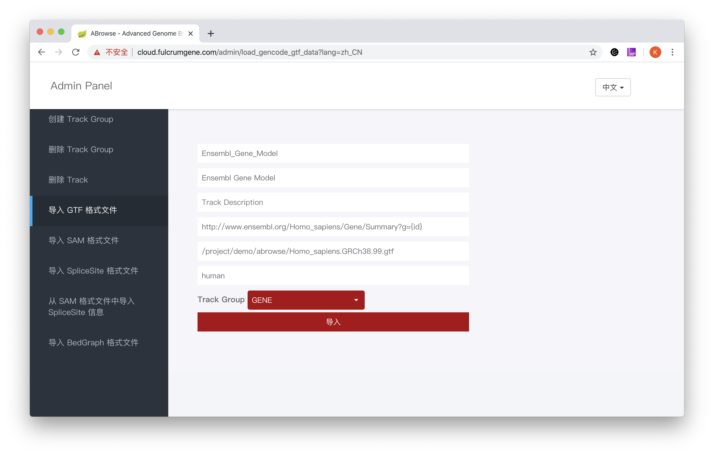

# ABrowse - The Advanced Genome Browser

[中文版](README.md)

## Introduction
ABrowse (Advanced Genome Browser) is a lightweight general-purpose Genome Browser framework that we developed to help 
biologists build an easy-to-use Genome Browser.
ABrowse's visualization engine runs in the browser, providing a very good interactive experience for users. 
The framework currently supports data formats such as GTF, BedGraph, SAM (SAM format support is shown in the screenshot 
below **RNASeq Mapping Sample** Track), and a custom data format for storing transcript splice sites. 
The data is imported into the local mongoDB via the interface provided by ABrowse, and developers can add support for
 more data formats based on our API.

ABrowse supports multiple visualization methods of the same data format, and with our JavaScript API, developers can add even 
more visualization methods to the data format.

This software is browser-server architecture, the back end uses the Spring Boot framework, the front uses HTML5 + JavaScript. 
The directory src/main/resources/docs/ has more documentation.

## Quick Start

### Screenshot
Let's start with a screenshot.


### Pre-request

* openjdk 1.8.0 (later than 1.8.0, or oracle-jdk should work as well, but is not tested)
* Apache Maven 3.6.1 (other versions should work, but is not tested)
* MariaDB 10.0 (MySQL or some other version of MariaDB should work, but is not tested)
* MongoDB 2.6.10 (other versions should work, but is not tested)
* a browser that supports SVG and HTML5 (who doesn't? We recommend chrome or firefox or safari)

### Create Database in MariaDB/MySQL
As a demo version, please do not change the following statement (If you want to use another password, 
please modify *spring.datasource.password* in file src/main/resources/application )
```sql
# create abrowse database
create database abrowse;

# create user abrowse，only allowed connection from localhost，the password is abs_passwd
grant all privileges on abrowse.* to 'abrowse'@'localhost' identified by 'abs_passwd';

# create user abrowse，only allowed connection from 127.0.0.1，the password is abs_passwd
grant all privileges on abrowse.* to 'abrowse'@'127.0.0.1' identified by 'abs_passwd';

# update privileges
flush privileges;
``` 

### import the genome configure json files to mongodb
```bash
## import the global configuration
mongoimport -d abrowsedemo -c config_genome --file src/main/resources/docs/conf/global.abrowse.json --jsonArray

## import human genome configuration
mongoimport -d abrowsedemo -c config_genome --file src/main/resources/docs/conf/human.abrowse.json --jsonArray
```

### Compile and Run
```bash
git clone https://github.com/klcola/abrowse.git
cd abrowse
# If it is the first compile, this step could take quite a few minutes to finish since
# maven will download many depended jar packages.
mvn clean install

java -jar target/abrowse-2.0-alpha.jar
```

If all goes well, open the browser and input 'http://127.0.0.1:8383' in the address bar, and you will see the abrowse 
index page in the web browser. You will see a blank canvas in the page because we does not import any data into the
abrowse database yet.

### Add Admin User Recorder
Now let's add admin user for abrowe. Please **MAKE SURE** you have finished the previous step, or the table in MariaDB/MySQL
will not be created automatically. 
```sql
use abrowse;
insert into role values (1, 'ROLE_ADMIN');
insert into role values (10000000, 'ROLE_USER');

# abrowse_demo 是密码，gly 是用户名，这两个都可以改成你自己的
insert into user values (1, 'abrowse_demo', 'gly');
insert into user_roles values (1, 1);
```

### Import GTF Data
To click the '登录' button and then type the username **gly**, password **abrowse_demo** to login. After that, click
the gear button left to the '退出gly' button, you will see the following page
 

You may first delete the empty old track by entering the 'DELETE TRACK' page. Then go to ensembl web site to download gtf file.
```bash
wget ftp://ftp.ensembl.org/pub/release-99/gtf/homo_sapiens/Homo_sapiens.GRCh38.99.gtf.gz
gzip -d Homo_sapiens.GRCh38.99.gtf.gz
```

Entering the 'LOAD GENCODE GTF DATA' page，and fill the blanks as the following picture. Please note that the TrackName
**SHOULD NOT** has space character, the Track Display Name could have space character, the Track Description could have
space character and could also be blank. And fill the absolute path of file Homo_sapiens.GRCh38.99.gtf and click the 
'IMPORT' button.
 

Finally, we get our first ABrowse running instance.
 

## To Developers

templates name rules: the / should be replaced by __

eg：
```
/admin/user_management/create_user

admin__user_management__create_user
```

thymeleaf variables' name rules：
The iterator of Map should end with *Entry*，eg：
```html
<select name="trackGroupName" id="trackGroupName" class="selectpicker">
    <option th:each="trackGroupEntry : ${configGenome.trackGroupMap}" th:value="${trackGroupEntry.value.name}"
            th:text="${trackGroupEntry.value.displayName}">
    </option>
</select>
```

git default case insensitive，to make git case sensitive：
```bash
git config core.ignorecase false
```
## Multiple Language support
ABrowse supports multiple languages，please refer to [src/resources/i18n/](src/resources/i18n/) for more information.

## Contact
kongl@mail.cbi.pku.edu.cn

## Disclaimer
This program is free software: you can redistribute it and/or modify
it under the terms of the GNU General Public License as published by
the Free Software Foundation, either version 3 of the License, or
(at your option) any later version.
This program is distributed in the hope that it will be useful,
but WITHOUT ANY WARRANTY; without even the implied warranty of
MERCHANTABILITY or FITNESS FOR A PARTICULAR PURPOSE.  See the
GNU General Public License for more details.
You should have received a copy of the GNU General Public License
along with this program. If not, see <http://www.gnu.org/licenses/>.