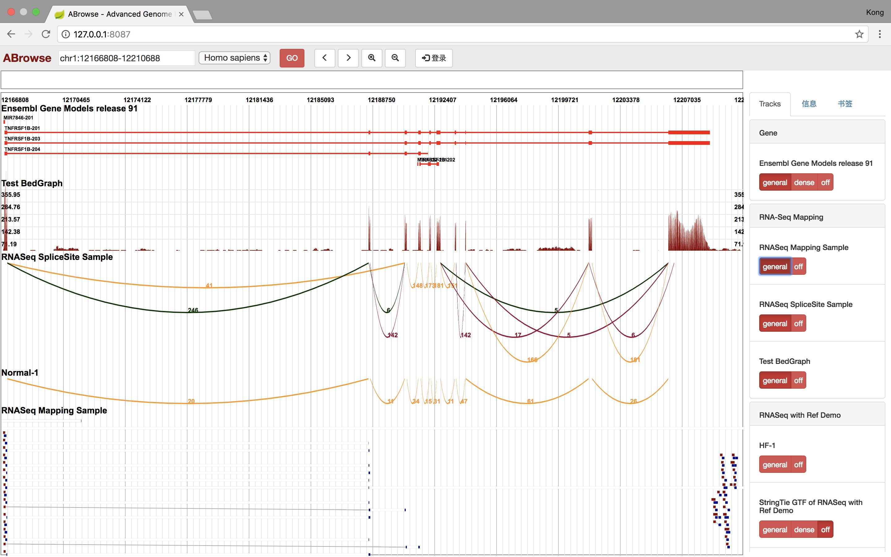

# ABrowse - The Advanced Genome Browser

[中文版](README.md)

## Introduction
ABrowse (Advanced Genome Browser) is a lightweight general-purpose Genome Browser framework that we developed to help 
biologists build an easy-to-use Genome Browser.
ABrowse's visualization engine runs in the browser, providing a very good interactive experience for users. 
The framework currently supports data formats such as GTF, BedGraph, SAM (SAM format support is shown in the screenshot 
below **RNASeq Mapping Sample** Track), and a custom data format for storing transcript splice sites. 
The data is imported into the local mongoDB via the interface provided by ABrowse, and developers can add support for
 more data formats based on our API.

ABrowse supports multiple visualization methods of the same data format, and with our JavaScript API, developers can add even 
more visualization methods to the data format.

This software is browser-server architecture, the back end uses the Spring Boot framework, the front uses HTML5 + JavaScript. 
The directory src/main/resources/docs/ has more documentation.

ABrowse is currently distributed under the GPL copyright.

## Quick Start

### Screenshot
Let's start with a screenshot.


### Pre-request

* openjdk 1.8.0 (later than 1.8.0, or oracle-jdk should work as well, but is not tested)
* Apache Maven 3.6.1 (other versions should work, but is not tested)
* MariaDB 10.0 (MySQL or some other version of MariaDB should work, but is not tested)
* MongoDB 2.6.10 (other versions should work, but is not tested)
* a browser that supports SVG and HTML5 (who doesn't?)

### Create Database in MariaDB/MySQL
As a demo version, please do not change the following statement (If you want to use another password, 
please modify *spring.datasource.password* in file src/main/resources/application )
```sql
# create abrowse database
create database abrowse;

# create user abrowse，only allowed connection from localhost，the password is abs_passwd
grant all privileges on abrowse.* to 'abrowse'@'localhost' identified by 'abs_passwd';

# create user abrowse，only allowed connection from 127.0.0.1，the password is abs_passwd
grant all privileges on abrowse.* to 'abrowse'@'127.0.0.1' identified by 'abs_passwd';

# update privileges
flush privileges;
``` 