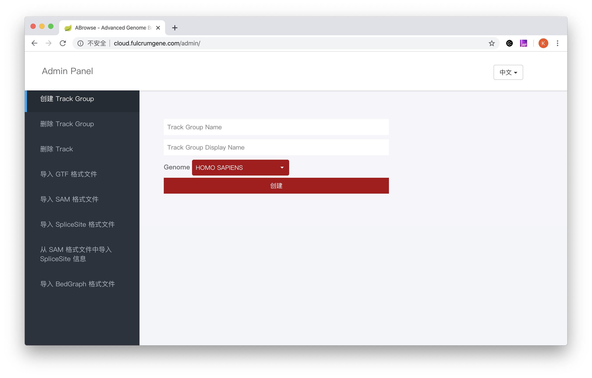

# ABrowse 基因组浏览器

[English Version](README.en.md)
## 简介

ABrowse (Advanced Genome Browser，其实取这个名字是为了按字母排序的时候我们能排在前面^^)是一款轻量级的通用基因组浏览器框架，我们开发它的目的是为
了帮助生物学家们搭建一个方便易用的基因组浏览器。
ABrowse 的可视化功能全部在浏览器端实现，可以为用户提供非常好的交互式体验。该框架目前支持的数据格式有 GTF、BedGraph、
SAM（SAM 格式支持见下面屏幕截图中的 **RNASeq Mapping Sample** Track） 
以及一种我们自定义的存储可变剪切位点的数据格式。这些数据通过 ABrowse 提供的界面导入本地 mongoDB 中，开发者可以根据我们的 API 增加对更多数据格式的支持。
ABrowse 支持为同一种数据格式提供多种不同的可视化形式，通过我们提供的 JavaScript API，开发者可以为数据格式增加更多的可视化形式。

本软件为 Browser-Server 架构，后端使用了 Spring Boot 框架，前端为 HTML5 + JavaScript 实现。 src/main/resources/docs/ 目录中有更多文档。

ABrowse 目前按照 GPL 版权发布。

## 快速上手指南

### 屏幕截图
先来一张屏幕截图，有一个直观印象


### 所需软件

* openjdk 1.8.0 （1.8.0 以后版本，或者 oracle-jdk 应该也可以正常工作，但作者未测试过）
* Apache Maven 3.6.1 （其他版本应该也可以正常工作，但作者未测试过）
* MariaDB 10.0 （MySQL 或者 MariaDB 的其他版本应该也可以正常工作，但作者未测试过）
* MongoDB 2.6.10 （其他版本应该也可以正常工作，但作者未测试过）
* 一款支持 SVG 和 HTML5 的浏览器（这谁没有呢～ 我们推荐 chrome 或者火狐或者 safari）

### 在 MySQL 中创建用户数据库

作为演示版本，以下语句请不要改动（如果需要使用其他密码，请修改 
src/main/resources/application.properties 文件中的 spring.datasource.password 属性）
```sql
# 创建 abrowse 数据库
create database abrowse;

# 创建 abrowse 用户，仅限从 localhost 登录，密码为 abs_passwd
grant all privileges on abrowse.* to 'abrowse'@'localhost' identified by 'abs_passwd';

# 创建 abrowse 用户，仅限从 127.0.0.1 登录，密码为 abs_passwd
grant all privileges on abrowse.* to 'abrowse'@'127.0.0.1' identified by 'abs_passwd';

# 更新权限
flush privileges;
``` 

### 将 genome 配置 json 文件导入 mongodb
```bash
## 导入全局配置
mongoimport -d abrowsedemo -c config_genome --file src/main/resources/docs/conf/global.abrowse.json --jsonArray

## 导入人类基因组配置
mongoimport -d abrowsedemo -c config_genome --file src/main/resources/docs/conf/human.abrowse.json --jsonArray
```

### 编译项目并运行
```bash
git clone https://github.com/klcola/abrowse.git
cd abrowse
# 如果是第一次编译，maven 会自动下载很多依赖的 jar 包，所以本步骤可能会花比较长的时间
mvn clean install

java -jar target/abrowse-2.0-alpha.jar
```
如果一切正常，这个时候打开浏览器，在地址栏输入 http://127.0.0.1:8383/ ，就可以看到 abrowse 的页面了。当然画布里什么内容也没有，那是
因为我们还没有导入数据。

### 向 MySQL 数据库中插入用户信息
现在给 abrowse 系统添加一个管理员用户，请**一定要**运行完上一步的编译项目再来运行这一步，否则表结构不会自动生成。
```sql
use abrowse;
insert into role values (1, 'ROLE_ADMIN');
insert into role values (10000000, 'ROLE_USER');

# abrowse_demo 是密码，gly 是用户名，这两个都可以改成你自己的
insert into user values (1, 'abrowse_demo', 'gly');
insert into user_roles values (1, 1);
```

### 导入数据
点击登录输入管理员用户名 **gly**，密码 **abrowse_demo**，登录后，点击 "退出gly" 按钮左边的齿轮按钮，就看到如下界面
 

可以先进入 "删除 Track" 页面将旧的空 Track 删除，然后下载 Ensembl gtf 文件
```bash
wget ftp://ftp.ensembl.org/pub/release-99/gtf/homo_sapiens/Homo_sapiens.GRCh38.99.gtf.gz
gzip -d Homo_sapiens.GRCh38.99.gtf.gz
```
进入 "导入 GTF 格式文件" 页面，如下图填写信息，注意 TrackName **不能** 有空格，Track Display Name 可以有空格，Track Description
可以有空格，也可以不填。Homo_sapiens.GRCh38.99.gtf 文件位置根据实际情况填写，填好点击 "导入" 按钮即可。
 

这样，我们的第一个基因组浏览器就完成了。
 

## 写给开发者

templates 页面命名规则: 反斜线 / 被替换为双下划线 __

例如：
```
/admin/user_management/create_user

admin__user_management__create_user
```

thymeleaf 变量命名规则：
Map 的遍历变量以 Entry 结尾，例如：
```html
<select name="trackGroupName" id="trackGroupName" class="selectpicker">
    <option th:each="trackGroupEntry : ${configGenome.trackGroupMap}" th:value="${trackGroupEntry.value.name}"
            th:text="${trackGroupEntry.value.displayName}">
    </option>
</select>
```

git 默认对于文件名大小写不敏感，如下命令配置 git 使其对文件名大小写敏感：
```bash
git config core.ignorecase false
```

## 多语言支持
ABrowse 支持多语言，请参考 [src/resources/i18n/](src/resources/i18n/) 目录

## 联系作者
kongl@mail.cbi.pku.edu.cn

## 免责声明
本软件并未经历过在任何情形下都可用的严格测试，不能保证本软件完全没有错误，使用本软件产品风险由用户自行承担，在适用法律允许的最大范围内，对因使用或不能使用本软件所产生的损害及风险，包括但不限于直接或间接的个人损害、科学研究中的数据错误、商业盈利的丧失、贸易中断、商业信息的丢失或任何其他经济或非经济的损失，作者不承担任何责任。
